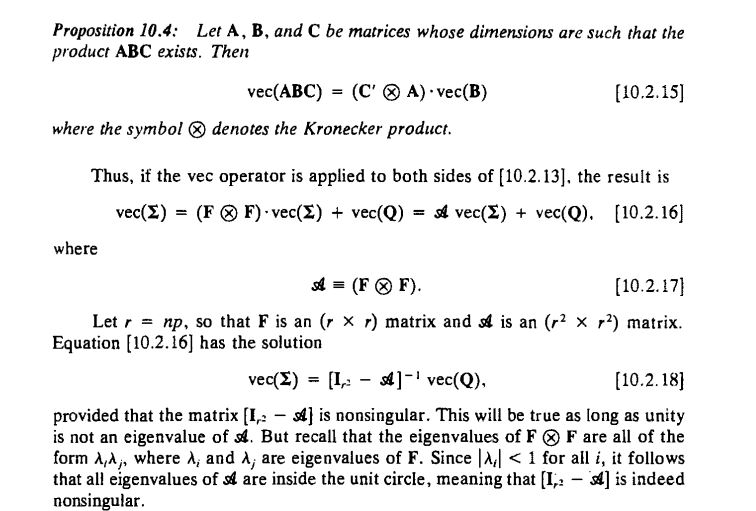

# 1. Dynamic Factor Models

The Kalman filter is a recursive algorithm for estimating the latent state of a linear dynamical system conditioned on the observations.

We have a vector $y_t$ of dimension $(n x 1)$. Suppose we have $(r x 1)$ non observables variable, $h_t$ which are important to model this vector in such a way that we can write, where $x_t$ are $k$ explanatory exogeneous variables:

$$
\begin{align*}
y_t &= A'x_t + H'h_t +w_t  \quad Observation \quad Eq. \\
h_{t+1} &= Fh_{t} + v_{t+1}  \quad \quad \quad \quad \quad \quad \quad State\quad Eq.
\end{align*}
$$

The dimension of the matrices are :
$$
\begin{aligned}
& F=(r x r) \\
& A^{\prime}=(n x k) \\
& H^{\prime}=(n x r)
\end{aligned}
$$

Vectors $w_t$ and $v_t$ are white noise and:

$$
\begin{aligned}
& E\left(\mathbf{v}_\tau \mathbf{v}_\tau^{\prime}\right)= \begin{cases}\mathbf{Q} & \text { for } t=\tau \\
0 & \text { otherwise }\end{cases} \\
& E\left(\mathbf{w}_t \mathbf{w}_\tau^{\prime}\right)= \begin{cases}\mathbf{R} & \text { for } t=\tau \\
0 & \text { otherwise }\end{cases}
\end{aligned}
$$

The dimension of $R$ y $Q$ are $(n x n)$ y $(r x r)$. The disturbances
v, and w, are assumed to be uncorrelated at all lags:

$$
\begin{aligned}
E\left(v_t w_\tau^{\prime}\right)=0 \quad for\quad all \quad t,\quad and \quad \tau
\end{aligned}
$$

It is important to realize that $x_t$ es exogeneous. This implies that it has no information on $\mathrm{h}_{t+s}$ or $w_{t+s}$ for $\mathrm{s}=0,1,2, \ldots$ beyond that contained in $y_{t-1}$

The state equation implies that $h$, can be written as a linear function of $\left( h_1,  \mathbf{v}_2, \mathbf{v}_3, \ldots, \mathbf{v}_r\right)$

$$
\begin{gathered}
h_t=\mathbf{v}_t+\mathbf{F} \mathbf{v}_{t-1}+\mathbf{F}^2 \mathbf{v}_{t-2}+\cdots+\mathbf{F}^{\prime-2} \mathbf{v}_2+\mathbf{F}^{t-1} h_1 \\
\text { for } t=2,3, \ldots, T
\end{gathered}
$$

Thus, it implies that $v$, is uncorrelated with lagged values of $h$ :

$$
E\left(v_t h_\tau^{\prime}\right)=0 \quad \text { for } \tau=t-1, t-2, \ldots, 1 .
$$
Simitariy,

$$
\begin{aligned}
& E\left(\mathbf{w}_t h_\tau^{\prime}\right)=\boldsymbol{\theta} \text { for } \tau=1,2, \ldots, T \\
& E\left(\mathbf{w}_{,} \mathbf{y}_\tau^{\prime}\right)=E\left[\mathbf{w}_{\boldsymbol{\prime}}\left(\mathbf{A}^{\prime} \mathbf{x}_{\boldsymbol{\tau}}+\mathbf{H}^{\prime} h_\tau+\mathbf{w}_\tau\right)^{\prime}\right] \\
& =0 \text { for } \tau=t-1, t-2, \ldots, 1 \\
& E\left(\mathbf{v}_t \mathbf{y}_\tau^{\prime}\right)=\mathbf{0} \quad \text { for } \tau=t-1, t-2, \ldots, 1 \text {. } \\
&
\end{aligned}
$$

> **_NOTE:_**  Examples of State-Space Representations
> Consider a univariate $A R(p)$ process,
> $$
> \begin{aligned}
> y_{t+1}-\mu= & \phi_1\left(y_t-\mu\right)+\phi_2\left(y_{t-1}-\mu\right)+\cdots \\
> & \quad+\phi_p\left(y_{t-p+1}-\mu\right)+\varepsilon_{t+1}, \\
> E\left(\varepsilon_t \varepsilon_\tau\right)= & \begin{cases}\sigma^2 & \text { for } > t=\tau \\
> 0 & \text { otherwise. }\end{cases}
> \end{aligned}
> $$
> This could be written in state-space form as follows:
> State Equation $(r=p)$ :
> $$
> \begin{aligned}
& {\left[\begin{array}{c}
y_{t+1}-\mu \\
y_t-\mu \\
\vdots \\
y_{t-p+2}-\mu
\end{array}\right]} \\
& \quad=\left[\begin{array}{ccccc}
\phi_1 & \phi_2 & \cdots & \phi_{p-1} & \phi_p \\
1 & 0 & \cdots & 0 & 0 \\
0 & 1 & \cdots & 0 & 0 \\
\vdots & \vdots & \cdots & \vdots & \vdots \\
0 & 0 & \cdots & 1 & 0
\end{array}\right]\left[\begin{array}{c}
y_t-\mu \\
y_{t-1}-\mu \\
\vdots \\
y_{t-p+1}-\mu
\end{array}\right]+\left[\begin{array}{c}
\varepsilon_{t+1} \\
0 \\
\vdots \\
0
\end{array}\right]
\end{aligned}
$$
> Observation Equation ( $n=1)$ :
> $$
y_t=\mu+\left[\begin{array}{llll}
1 & 0 & \cdots & 0
\end{array}\right]\left[\begin{array}{c}
y_t-\mu \\
y_{t-1}-\mu \\
\vdots \\
y_{t-p+1}-\mu
\end{array}\right] .
$$
> That is, we would specify
> $$
\begin{aligned}
& h_t=\left[\begin{array}{c}
y_t-\mu \\
y_{t-1}-\mu \\
\vdots \\
y_{t-p+1}-\mu
\end{array}\right] \quad \mathbf{F}=\left[\begin{array}{ccccc}
\phi_1 & \phi_2 & \cdots & \phi_{p-1} & \phi_p \\
1 & 0 & \cdots & 0 & 0 \\
0 & 1 & \cdots & 0 & 0 \\
\vdots & \vdots & \cdots & \vdots & \vdots \\
0 & 0 & \cdots & 1 & 0
\end{array}\right] \\
& \mathbf{v}_{t+1}=\left[\begin{array}{c}
\varepsilon_{t+1} \\
0 \\
\vdots \\
0
\end{array}\right] \quad \mathbf{Q}=\left[\begin{array}{cccc}
\sigma^2 & 0 & \cdots & 0 \\
0 & 0 & \cdots & 0 \\
\vdots & \vdots & \cdots & \vdots \\
0 & 0 & \cdots & 0
\end{array}\right] \\
& \mathbf{y}_t=y_t \quad \mathbf{A}^{\prime}=\mu \quad \mathbf{x}_t=1 \\
& \mathbf{H}^{\prime}=\left[\begin{array}{llll}
1 & 0 & \cdots & 0
\end{array}\right] \quad \mathbf{w}_t=0 \quad \mathbf{R}=0 . \\
&
\end{aligned}
$$

Derivation of the Kalman Filter
Consider the general state-space system, whose key equations are reproduced here for convenience:
$$
\begin{aligned}
& \underset{(r \times 1)}{h_{r+1}}=\underset{(r \times r)(r \times 1)}{\mathbf{F} \cdot h_t}+\underset{(r \times 1)}{\mathbf{v}_{r+1}} \\
& \underset{(n \times 1)}{\mathbf{y}_t}=\underset{(n \times k)(k \times 1)}{\mathbf{A}^{\prime} \cdot \mathbf{x}_t}+\underset{(n \times r)(r \times 1)}{\mathbf{H}^{\prime} \cdot h_1}+\underset{(n \times 1)}{\mathbf{w}_t} \\
& E\left(\mathbf{v}_{,} \mathbf{v}_\tau^{\prime}\right)=\left\{\begin{array}{cl}
\underset{(r \times r)}{\mathbf{Q}} & \text { for } t=\tau \\
\mathbf{0} & \text { otherwise }
\end{array}\right. \\
& E\left(\mathbf{w}_t \mathbf{w}_\tau^{\prime}\right)=\left\{\begin{array}{cl}
\mathbf{R} & \text { for } t=\tau \\
\mathbf{0} \times(n) & \text { otherwise. }
\end{array}\right. \\
&
\end{aligned}
$$

The analyst is presumed to have observed $y_1, y_2, ... , Y_T, x_1, X_2, .. , X_T$. One of the ultimate objectives may be to estimate the values of any unknown
parameters in the system on the basis of these observations. For now, however,
we will assume that the particular numerical values of $F, Q, A, H$ and $R$ are known
with certainty. 

There are many uses of the Kalman filter. It is motivated here as an algorithm for calculating linear least squares forecasts of the state vector on the basis of data observed through date $t$

Therefore, the econometrician observes $y_t$
; $xt$ and we have two problems:
1) Calculation $F, Q, A, H$ and $R$
2) Calculation $h_t$

Let's start with 2 assuming that we know 1

$$
h_{t/t-1} = E[h_t|Y_{t-1}]
$$

Where $Y_{t-1}$ represents the information up to period t

$$
Y_{t-1} = (y_{t-1}, y_{t-2}, ...y_1 ,x_t, x_{t-1}, .. , x_1)
$$

Notice that the indpenedent variables have information content until $x_t$. 

 It is motivated here as an algorithm 
for calculating linear least squares forecasts of the state vector on the basis of data observed through date t
We can define then the MSE of dimension $(rxr)$ such as, the associated with each of these forecasts is a mean squared 
error (MSE) matrix, r

$$
P_{t|t-1} = E[(h_t - h_{t|t-1})(h_t-h_{t|t-1})']
$$

Which is somehow similar to the classic MSE estimator for OLS

$$
\begin{equation*}
\operatorname{MSE}(\hat{Y}) = \operatorname{E} \left [\left(\hat{Y}-\mu\right)\left(\hat{Y}-\mu\right)^T \right]
\end{equation*}
$$

1.1.1 Calculation of $h_t$

The recursion begins with $h_{1|0}$ whcih denotes a forecast of $h_1$ based on no observations of $y$ or $x$. This is just the unconditional mean of $h_1$ 

$$
h_{1|0} = E[h_1]
$$

with associated MSE 

$$
P_{1|0} = E[(h_1 - E[h_1])(h_1- E[h_1])']
$$

For example, consider the univariate $MA(1)$ process:

$
y_t = \mu + \varepsilon_t + +\theta\varepsilon_{t-1}
$

This could be written in state-space form as follwos 

$$
\begin{aligned}
& \underset{(r \times 1)}{h_{r+1}}=\underset{(r \times r)(r \times 1)}{\mathbf{F} \cdot h_t}+\underset{(r \times 1)}{\mathbf{v}_{r+1}} \\
& \underset{(n \times 1)}{\mathbf{y}_t}=\underset{(n \times k)(k \times 1)}{\mathbf{A}^{\prime} \cdot \mathbf{x}_t}+\underset{(n \times r)(r \times 1)}{\mathbf{H}^{\prime} \cdot h_1}+\underset{(n \times 1)}{\mathbf{w}_t} \\
& E\left(\mathbf{v}_{,} \mathbf{v}_\tau^{\prime}\right)=\left\{\begin{array}{cl}
\underset{(r \times r)}{\mathbf{Q}} & \text { for } t=\tau \\
\mathbf{0} & \text { otherwise }
\end{array}\right. \\
& E\left(\mathbf{w}_t \mathbf{w}_\tau^{\prime}\right)=\left\{\begin{array}{cl}
\mathbf{R} & \text { for } t=\tau \\
\mathbf{0} \times(n) & \text { otherwise. }
\end{array}\right. \\
&
\end{aligned}
$$

State Equation ( $r=2)$ :
$$
\left[\begin{array}{c}
\varepsilon_{t+1} \\
\varepsilon_t
\end{array}\right]=\left[\begin{array}{ll}
0 & 0 \\
1 & 0
\end{array}\right]\left[\begin{array}{c}
\varepsilon_t \\
\varepsilon_{t-1}
\end{array}\right]+\left[\begin{array}{c}
\varepsilon_{t+1} \\
0
\end{array}\right]
$$
Observation Equation $(n=1)$ :
$$
y_t=\mu+\left[\begin{array}{ll}
1 & \theta
\end{array}\right]\left[\begin{array}{c}
\varepsilon_t \\
\varepsilon_{t-1}
\end{array}\right]
$$

That is:

$$
\begin{aligned}
& \boldsymbol{h}_t=\left[\begin{array}{c}
\varepsilon_t \\
\varepsilon_{t-1}
\end{array}\right] \quad \mathbf{F}=\left[\begin{array}{ll}
0 & 0 \\
1 & 0
\end{array}\right] \quad \mathbf{v}_{t+1}=\left[\begin{array}{c}
\varepsilon_{t+1} \\
0
\end{array}\right] \\
& \mathbf{Q}=\left[\begin{array}{cc}
\sigma^2 & 0 \\
0 & 0
\end{array}\right] \quad \mathbf{y}_t=y_t \quad \mathbf{A}^{\prime}=\mu \quad \mathbf{x}_t=1 \\
& \mathbf{H}^{\prime}=\left[\begin{array}{ll}
1 & \theta
\end{array}\right] \quad \mathbf{w}_t=0 \quad \mathbf{R}=0 .
\end{aligned}
$$

Therefore we may use our state vector: 

$$
\boldsymbol{h}_t=\left[\begin{array}{c}
\varepsilon_t \\
\varepsilon_{t-1}
\end{array}\right]
$$
For which:

$$
\boldsymbol{h}_{1|0}= E\left[\begin{array}{c}
\varepsilon_t \\
\varepsilon_{t-1}
\end{array}\right]=
\left[\begin{array}{c}
0 \\
0
\end{array}\right]
$$

Therefore: 

$$
\mathbf{P}_{1[0}=E\left(\left[\begin{array}{l}
\varepsilon_1 \\
\varepsilon_{01}
\end{array}\right]\left[\begin{array}{ll}
\varepsilon_1 & \left.\varepsilon_0\right]
\end{array}\right]\right)=\left[\begin{array}{cc}
\sigma^2 & 0 \\
0 & \sigma^2
\end{array}\right]
$$

Where $\sigma^2 = E[\varepsilon_t^2]$

More generally, if eigenvalues of $F$ are all inside the unit circle, then the 
process is covariance-stationary. The unconditional mean often 
can be found by taking expectations of both sides of producing:

$$
E[h_{t+1}] = F \cdot E[h_t]
$$

Or since is covariance stationary: 

$$
(I_r - F)E[h_{t}] = 0
$$

Since unity is not an eigenvalue of $F$, the matrix $(I_r - F)$ is nonsingular, and this equation has the unique solution $E[h_t] = 0$ which is the same as saying $h_{0|0}=0$

Then, for the unconditoinal variance of $h_t$ it can be calcualted from 

$$
\begin{aligned}
 \underset{(r \times 1)}{h_{r+1}}=\underset{(r \times r)(r \times 1)}{\mathbf{F} \cdot h_t}+\underset{(r \times 1)}{\mathbf{v}_{r+1}} \\

\end{aligned}
$$

By mulptyling by $h_{t+1}'$ and taking unconditional expectations on both sides:

$$
\begin{aligned}
& E\left(h_{t+1} h_{t+1}^{\prime}\right)=E\left(\left(F h_t+v_{t+1}\right)\left(F h_t+v_{t+1}\right)^{\prime}\right)
\end{aligned}
$$

$$
\begin{aligned}

& E\left(\left(F h_t+v_{t+1}\right)\left(h_t^{\prime} F^{\prime}+v_{t+1}^{\prime}\right)\right)=F E\left(h_t h_t^{\prime}\right) F^{\prime}+E\left(v_{t+1} v_{t+1}^{\prime}\right) \\
\end{aligned}
$$

Calling:
$$
E\left(h_t h_t^{\prime}\right)=\sum
$$

Given that the cross products have dissapiared in light of the assumtion that the errors are uncorrelated with lagged values of $h$. The previous equation cna be written as: 

$$
\sum = F \sum F' + Q
$$

The solution to this equation is: 

$$
\begin{aligned}
& \operatorname{vec}\left(\sum\right)=\left(I_{r^2}-(F \otimes F)\right)^{-1} \operatorname{vec}(Q) \\
\end{aligned}
$$

Thus, in general, provided that the eigenvalues of $F$ are inside the unit circle, the 
Kalman filter iterations can be started with  $h_{1|0}= 0$ and $P_{1|0}$ the $(r x r)$ matrix 
whose elements expressed as a column vector are given by 

$$
\operatorname{vec}\left(P_{1 / 0}\right)=\left(I_{r^2}-(F \otimes F)\right)^{-1} \operatorname{vec}(Q)
$$

Which comes from:

## Forecasting

Given starting values $h_{1 \mid 0}$ and $\mathbf{P}_{1 \mid 0}$, the next step is to calculate analogous magnitudes for the following date, $\hat{h}_{2 \mid 1}$ and $\mathbf{P}_{2 \mid 1}$. The calculations for $t=2,3$, ..,$T$ all have the same basic form, so we will describe them in general terms for step $t$; given $h_{t \mid t-1}$ and $\mathbf{P}_{t \mid,-1}$, the goal is to calculate $\hat{\boldsymbol{h}}_{t+1 \mid}$ and $\mathbf{P}_{t+1 \mid t}$

Next consider forecasting the value of $\mathbf{y}_t$ :

Notice from $[13.2 .2]$ that
$$
\hat{\mathbf{y}}_{t \mid t-1} \equiv E\left(\mathbf{y}_t \mid \mathbf{x}_t, \mathscr{y}_{t-1}\right)
$$
$$
E\left(\mathbf{y}_t \mid \mathbf{x}_t, \boldsymbol{h}_t\right)=\mathbf{A}^{\prime} \mathbf{x}_t+\mathbf{H}^{\prime} \boldsymbol{h}_t,
$$

So, from the law of iterated projections,
$$
\hat{\mathbf{y}}_{t \mid t-1}=\mathbf{A}^{\prime} \mathbf{x}_t+\mathbf{H}^{\prime} \cdot \hat{E}\left(\boldsymbol{h}_t \mid \mathbf{x}_t, \mathcal{G}_{t-1}\right)=\mathbf{A}^{\prime} \mathbf{x}_t+\mathbf{H}^{\prime} \hat{h}_{t \mid t-1} \quad \text { [13.2.9] }
$$

And the error of this forecast is
$$
\begin{aligned}
& \mathbf{y}_t-\hat{\mathbf{y}}_{t \mid t-1}=\mathbf{A}^{\prime} \mathbf{x}_t+\mathbf{H}^{\prime} \boldsymbol{h}_t+\mathbf{w}_t-\mathbf{A}^{\prime} \mathbf{x}_t-\mathbf{H}^{\prime} h_{t \mid t-1}=\mathbf{H}^{\prime}\left(\boldsymbol{h}_t-\boldsymbol{h}_{t \mid t-1}\right)+\mathbf{w}_t \\
& \\\
\end{aligned}
$$
With MSE 
$$
\begin{aligned}
& E\left[\left(\mathbf{y}_t-\hat{\mathbf{y}}_{t \mid t-1}\right)\left(\mathbf{y}_t-\hat{\mathbf{y}}_{t \mid t-1}\right)^{\prime}\right] \\
& =E\left[\mathbf{H}^{\prime}\left(\boldsymbol{h}_t-\boldsymbol{h}_{t \mid t-1}\right)\left(\boldsymbol{h}_t-\boldsymbol{h}_{t \mid t-t}\right)^{\prime} \mathbf{H}\right]+E\left[\mathbf{w}_t \mathbf{w}_t^{\prime}\right] \\
&
\end{aligned}
$$
Cross-product terms have disappeared, since
$$
E\left[\mathbf{w}_t\left(\boldsymbol{h}_t-\hat{\boldsymbol{h}}_{t \mid t-1}\right)^{\prime}\right]=0 . \quad \text { [13.2.11] }
$$
T
Now let's see in general how the information is taken into the model
in $t-1$ we know
Yt

## Updating the Inference About $h_t$

$$
\left[\begin{array}{l}
\Delta y_{1 t} \\
\Delta y_{2 t} \\
\Delta y_{3 t} \\
\Delta y_{4 t}
\end{array}\right]=\left[\begin{array}{llllllllll}
\gamma_1 & 0 & 1 & 0 & 0 & 0 & 0 & 0 & 0 & 0 \\
\gamma_2 & 0 & 0 & 0 & 1 & 0 & 0 & 0 & 0 & 0 \\
\gamma_3 & 0 & 0 & 0 & 0 & 0 & 1 & 0 & 0 & 0 \\
\gamma_4 & 0 & 0 & 0 & 0 & 0 & 0 & 0 & 1 & 0
\end{array}\right]\left[\begin{array}{c}
\Delta c_t \\
\Delta c_{t-1} \\
e_{1 t} \\
e_{1 t-1} \\
e_{2 t} \\
e_{1 t-2} \\
e_{3 t} \\
e_{3 t-1} \\
e_{4 t} \\
e_{4 t-1}
\end{array}\right]
$$

transition equation:
$$
\left[\begin{array}{c}
\Delta c_t \\
\Delta c_{t-1} \\
e_{1 t} \\
e_{1 t-1} \\
e_{2 t} \\
e_{2 t-1} \\
e_{3 t} \\
e_{3 t-1} \\
c_{4 t} \\
e_{4 t-1}
\end{array}\right]=\left[\begin{array}{llllllllll}
\phi_1 & \phi_2 & 0 & 0 & 0 & 0 & 0 & 0 & 0 & 0 \\
1 & 0 & 0 & 0 & 0 & 0 & 0 & 0 & 0 & 0 \\
0 & 0 & \psi_{11} & \psi_{12} & 0 & 0 & 0 & 0 & 0 & 0 \\
0 & 0 & 1 & 0 & 0 & 0 & 0 & 0 & 0 & 0 \\
0 & 0 & 0 & 0 & \psi_{21} & \psi_{22} & 0 & 0 & 0 & 0 \\
0 & 0 & 0 & 0 & 1 & 0 & 0 & 0 & 0 & 0 \\
0 & 0 & 0 & 0 & 0 & 0 & \psi_{31} & \psi_{32} & 0 & 0 \\
0 & 0 & 0 & 0 & 0 & 0 & 1 & 0 & 0 & 0 \\
0 & 0 & 0 & 0 & 0 & 0 & 0 & 0 & \psi_{41} & \psi_{42} \\
0 & 0 & 0 & 0 & 0 & 0 & 0 & 0 & 1 & 0
\end{array}\right]\left[\begin{array}{c}
\Delta c_{t-1} \\
\Delta c_{t-2} \\
e_{1 t-1} \\
e_{1 t-2} \\
e_{2 t-1} \\
e_{2 t-2} \\
e_{3 t-1} \\
e_{3 t-2} \\
c_{4 t-1} \\
e_{4 t-2}
\end{array}\right]+
$$

* Modelling assumptions:

  Coming up with a model consists of making assumptions on the observations $R_i, i = 1, . . . ,n$ in order to draw statistical conclusions. Here are the assumptions we make:

  1. Each $R_i$ is a random variable.
  2. Each of the r.v. $R_i$ is ____ distributed with parameter $p$.
  3. $R_1, ..., R_n$ are mutually independent.

* Independent and identically distributed (i.i.d)

  A collection of random variable $X_1, ...,X_n$ are i.i.d if 
